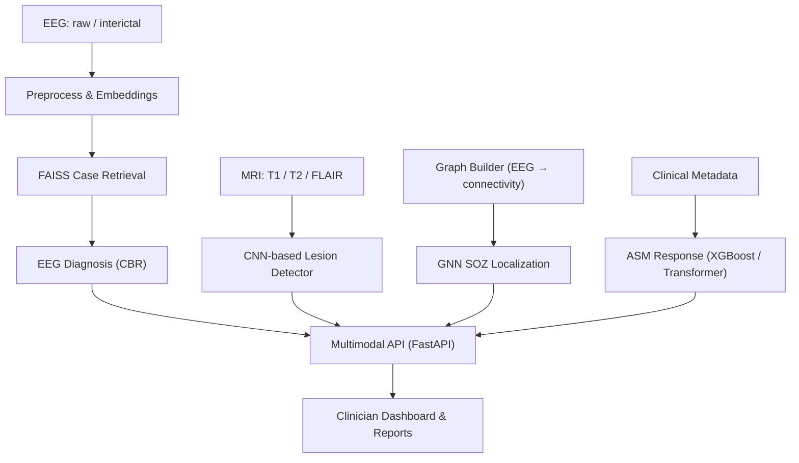

<!--
  NeuroGraphAI — Multimodal AI for Epilepsy
  README.md (HTML + GitHub-safe CSS-ish formatting)
-->

  <h1>🧠 NeuroGraphAI</h1>
  
<b>Multimodal AI System for Epilepsy Diagnosis & Treatment Response</b>

  <!-- Badges -->
  

    
    
    
    
    
  

  <!-- Quick Nav -->
  

    <a href="#overview">Overview</a> •
    <a href="#modules">Modules</a> •
    <a href="#architecture">Architecture</a> •
    <a href="#quickstart">Quickstart</a> •
    <a href="#datasets">Datasets</a> •
    <a href="#ui">Clinician UI</a> •
    <a href="#team">Team</a>
  

  <!-- Tagline -->
  <blockquote>
    <i>“Where brainwaves meet intelligence — empowering neurologists with interpretable AI.”</i>
  </blockquote>

  <!-- Hero -->
  

---

<h2>📘 Overview</h2>

<b>NeuroGraphAI</b> is an end-to-end, multimodal clinical decision-support system for epilepsy.  
It combines four components into one workflow:
<ul>
  <li><b>EEG-based diagnosis</b> using deep embeddings + case-based reasoning (CBR)</li>
  <li><b>MRI lesion detection</b> via CNNs with Grad-CAM explainability</li>
  <li><b>SOZ localization</b> (Seizure Onset Zone) from non-invasive interictal EEG using GNNs</li>
  <li><b>ASM response prediction</b> (anti-seizure medication) with XGBoost + SHAP</li>
</ul>

The system outputs <b>interpretable visuals</b> (saliency/Grad-CAM, attention heatmaps, SHAP plots) and a <b>unified clinician report</b> with confidence scores.

---

<h2>🧩 Modules</h2>

<table>
  <thead>
    <tr>
      <th>Module</th>
      <th>Focus</th>
      <th>Core Methods</th>
      <th>Outputs</th>
    </tr>
  </thead>
  <tbody>
    <tr>
      <td><b>1) EEG Diagnosis</b></td>
      <td>Epilepsy vs non-epilepsy from EEG</td>
      <td>Deep embeddings · FAISS ANN · CBR</td>
      <td>Case-matches · Confidence score · Similarity viz</td>
    </tr>
    <tr>
      <td><b>2) MRI Lesion Detection</b></td>
      <td>Hippocampal sclerosis, FCD, asymmetry</td>
      <td>CNN/UNet · Grad-CAM</td>
      <td>Lesion maps · Region report</td>
    </tr>
    <tr>
      <td><b>3) SOZ Localization</b></td>
      <td>SOZ from interictal scalp EEG</td>
      <td>Graph construction · GNN (GAT/GCN)</td>
      <td>Attention heatmaps · Electrode ranking</td>
    </tr>
    <tr>
      <td><b>4) ASM Response Prediction</b></td>
      <td>One-year seizure freedom likelihood</td>
      <td>XGBoost/TabTransformer · SHAP</td>
      <td>Probability · Feature attributions</td>
    </tr>
  </tbody>
</table>

  
<b>Key Features</b> (click to expand)

  <ul>
    <li>Multimodal fusion (EEG + MRI + clinical metadata)</li>
    <li>Real-time FAISS retrieval for CBR explanations</li>
    <li>Clinician-friendly interpretability (Grad-CAM, SHAP, attention)</li>
    <li>Low-resource deployability (scalable API, modular components)</li>
  </ul>

---

## 🧬 Architecture

<h2>⚡ Quickstart</h2> 
 
<b>1) Clone & Environment</b>

git clone https://github.com/<your-org>/neurographai.git
cd neurographai

# (Option A) Conda
conda create -n neurographai python=3.10 -y
conda activate neurographai

# (Option B) venv
python -m venv .venv && source .venv/bin/activate

 
 
<b>2) Install (core + extras)</b>

pip install -U pip wheel
pip install -r requirements.txt

# optional accelerators
pip install torch torchvision --index-url https://download.pytorch.org/whl/cu121

 
 
<b>3) Configure Datasets</b>

# put files like:
data/
  eeg/           # EEG (e.g., TUH EEG)
  mri/           # MRI (T1/T2/FLAIR)
  clinical/      # CSV/Parquet clinical metadata

 
 
<b>4) Run API & UI</b>

# start API
uvicorn app.main:api --host 0.0.0.0 --port 8000 --reload

# start dashboard (example)
streamlit run ui/Dashboard.py

<h2>📦 Datasets (examples)</h2> <ul> <li><b>EEG:</b> TUH EEG / CHB-MIT</li> <li><b>MRI:</b> MELD, open neuroimaging cohorts (T1/T2/FLAIR)</li> <li><b>Clinical metadata:</b> curated CSV/EMR exports (de-identified)</li> </ul>
<i>Note:</i> Use only ethically sourced, de-identified data. Comply with institutional approvals.

<h2>🖥️ Clinician UI (Highlights)</h2> <ul> <li><b>Case Explorer:</b> nearest-neighbor EEG matches with similarity rationale</li> <li><b>MRI Panel:</b> lesion probability maps + Grad-CAM overlay</li> <li><b>SOZ Map:</b> electrode/region attention heatmaps from GNN</li> <li><b>ASM Card:</b> seizure-freedom probability with SHAP explanations</li> <li><b>Report Export:</b> PDF with findings, confidence, and references</li> </ul>

<h2>🧠 Training & Evaluation</h2> <table> <tr> <td><b>EEG Diagnosis</b></td> <td>AUROC, F1, Precision@K (case retrieval), latency</td> </tr> <tr> <td><b>MRI Lesion</b></td> <td>Dice/IoU, sensitivity (lesion-wise), Grad-CAM sanity checks</td> </tr> <tr> <td><b>SOZ Localization</b></td> <td>Electrode-level AUC, top-K accuracy, clinical concordance</td> </tr> <tr> <td><b>ASM Response</b></td> <td>AUROC, PR-AUC, calibration (ECE), SHAP stability</td> </tr> </table>

<h2>🔐 Ethics & Privacy</h2> <ul> <li>De-identification and encryption for all PHI</li> <li>HIPAA/GDPR-aligned workflows</li> <li>Model cards and dataset statements for transparency</li> </ul>

<h2>🤝 Contributing</h2>
Fork & create a feature branch
Follow <code>black</code>/<code>ruff</code> formatting
Add tests & docs
Open a PR with a clear description and screenshots

<h2>🧑‍🔬 Research Team</h2> <ul> <li><b>P.A.S.R. Gunathilaka</b> — EEG Diagnosis</li> <li><b>H.V.D. Himsara</b> — MRI Lesion Detection</li> <li><b>B.G.S. Navodya</b> — ASM Response Prediction</li> <li><b>R.A.D.S. Ranaweera</b> — SOZ Localization</li> <li>Supervisors: <b>Prof. Samantha Thelijjagoda</b>, <b>Mr. Samadhi Rathnayake</b></li> </ul>

<h2>📜 Citation</h2>
If you use this project, please cite:
<pre> Gunathilaka P.A.S.R., Himsara H.V.D., Navodya B.G.S., Ranaweera R.A.D.S. (2025). NeuroGraphAI: A Multimodal AI System for Epilepsy Diagnosis & Treatment Response. Department of Computer Science, SLIIT. </pre>

 © 2025 NeuroGraphAI — MIT License  “Revolutionizing epilepsy care — one neural connection at a time.” ⚡ 
 

